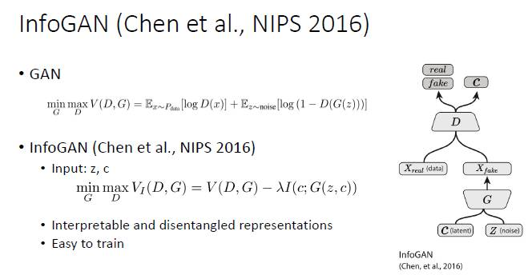

# tensorflow-infogan
TensorFlow implementation of [InfoGAN: Interpretable Representation Learning by Information Maximizing Generative Adversarial Nets, NIPS 2016](https://papers.nips.cc/paper/6399-infogan-interpretable-representation-learning-by-information-maximizing-generative-adversarial-nets)




## Installation

```
$ git clone https://github.com/kuc2477/tensorflow-infogan && cd tensorflow-infogan
$ pip install -r requirements.txt
```


## CLI

Implementation CLI is provided by `main.py`

#### Usage
```
$ ./main.py --help
$ usage: TensorFlow implementation of InfoGAN [-h] [--dataset DATASET]
                                            [--resize] [--crop]
                                            [--z-size Z_SIZES [Z_SIZES ...]]
                                            [--z-dist {categorical,mean-bernoulli,gaussian,uniform,bernoulli} [{categorical,mean-bernoulli,gaussian,uniform,bernoulli} ...]]
                                            [--c-size C_SIZES [C_SIZES ...]]
                                            [--c-dist {categorical,mean-bernoulli,gaussian,uniform,bernoulli} [{categorical,mean-bernoulli,gaussian,uniform,bernoulli} ...]]
                                            [--reg-rate [REG_RATE]]
                                            [--image-size IMAGE_SIZE]
                                            [--channel-size CHANNEL_SIZE]
                                            [--g-filter-number G_FILTER_NUMBER]
                                            [--d-filter-number D_FILTER_NUMBER]
                                            [--g-filter-size G_FILTER_SIZE]
                                            [--d-filter-size D_FILTER_SIZE]
                                            [--q-hidden-size Q_HIDDEN_SIZE]
                                            [--learning-rate LEARNING_RATE]
                                            [--beta1 BETA1] [--epochs EPOCHS]
                                            [--batch-size BATCH_SIZE]
                                            [--sample-size SAMPLE_SIZE]
                                            [--statistics-log-interval STATISTICS_LOG_INTERVAL]
                                            [--image-log-interval IMAGE_LOG_INTERVAL]
                                            [--checkpoint-interval CHECKPOINT_INTERVAL]
                                            [--generator-update-ratio GENERATOR_UPDATE_RATIO]
                                            [--sample-dir SAMPLE_DIR]
                                            [--checkpoint-dir CHECKPOINT_DIR]
                                            [--log-dir LOG_DIR] [--resume]
                                            (--test | --train)
```

#### Dataset
```
$ ./download.py mnist lsun
$ ./data.py export_lsun
```

#### Train
```
$ tensorboard --logdir=logs &
$ ./main.py --dataset=lsun [--resume]
```

#### Test
```
$ ./main.py --test
$ # checkout "./samples" directory.
```


## Reference
- [InfoGAN: Interpretable Representation Learning by Information Maximizing Generative Adversarial Nets, NIPS 2016](https://papers.nips.cc/paper/6399-infogan-interpretable-representation-learning-by-information-maximizing-generative-adversarial-nets)

## Author
Ha Junsoo / [@kuc2477](https://github.com/kuc2477) / MIT License
